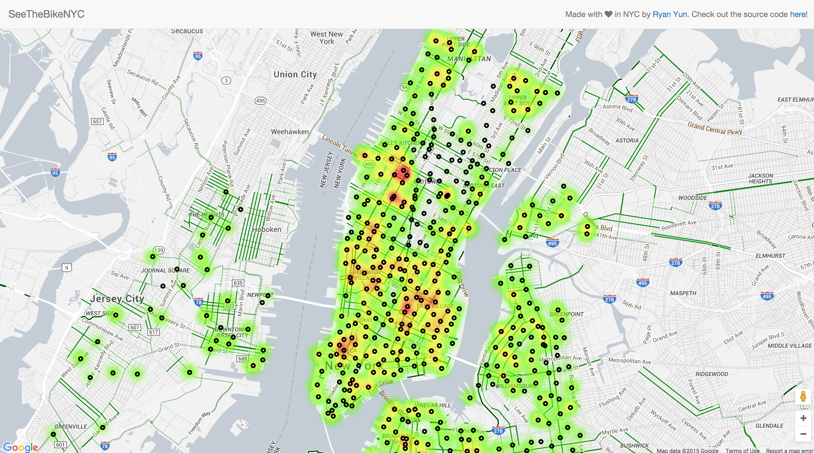
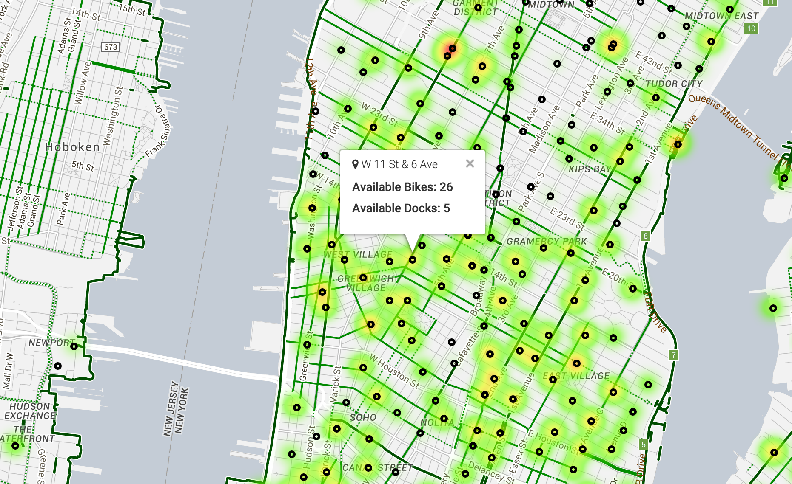

# SeeTheBikeNYC

## Description

This is a simple RoR application that utilizes the [Google Maps API](https://developers.google.com/maps/documentation/javascript/) & [CitiBike's Station API](http://www.citibikenyc.com/stations/json) to visualize available bikes in a heat map.

## Screenshots

"Easily see where available CitiBikes are with heat map"

"Hover over a station to see exactly how many bikes and docks are available"

## Background

As an avid CitiBiker, I constantly need to know where available bikes are. There are numerous applications that serve this purpose - but none that can help users get a sense at a quick glance. SeeTheBikeNYC aims to fill that void.

## Features

+ Instantly see available CitiBikes through beautiful heat map.
+ Plan your trips using the layered bicycle lanes.
+ Hover over a CitiBike station to see exactly how many bikes and docks are available.

## Contribute

Please feel free to contribute to this project.

## License

SeeTheBikeNYC is MIT Licensed. See LICENSE for details.